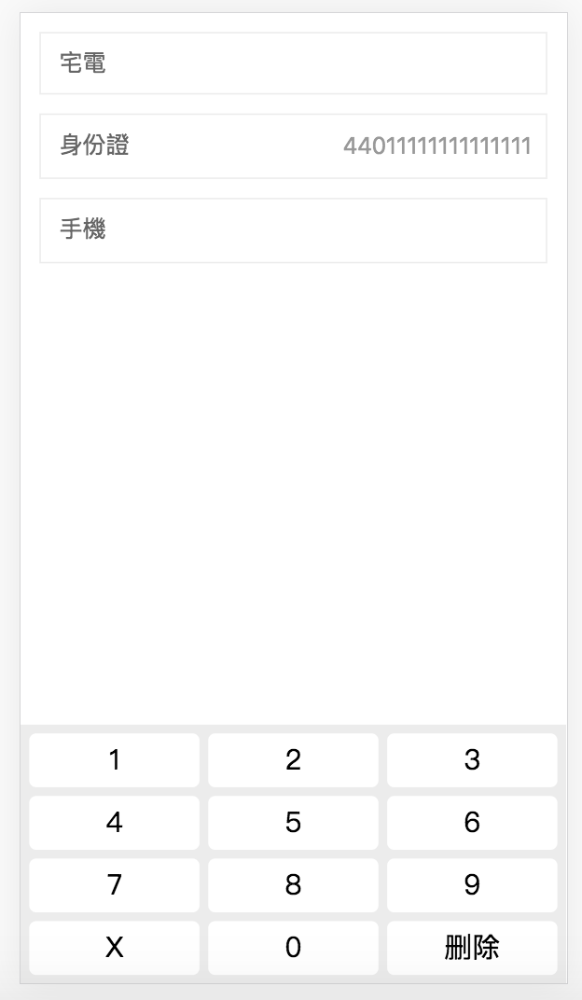

# vue-mobile-virtual-keyboard 1.2.1

[DEMO](http://139.196.220.25/demo/vue-mobile-virtual-keyboard/#/index )

受夠了需求老是要求【只能輸入純數字】【只能輸入身份證】的要求了

受夠了已經給設置自動展開數字鍵盤了，還硬是要自己點成英文輸入法，然後跟妳講【這裡不應該可以輸入英文】的xx測試

受夠了動不動就正則替換的人了

受夠了第三方輸入法的單詞聯想了

我要有一個鍵盤：

- 支持插件形式調用；

- 默認帶【身份證】【數字】【金額】鍵盤；

- 隨便自定義鍵盤佈局；

- ui要改主題，無所畏懼；

## 長這樣



## 安裝

```shell
$ npm install vue-mobile-virtual-keyboard -s
```

## 註冊

推薦全局安裝plugin使用

### 全局註冊

```javascript
// 在入口文件全局引入
import Vue from 'vue';
import { KeyboardPlugin } from 'vue-mobile-virtual-keyboard';

Vue.use(KeyboardPlugin);
```

### 局部註冊

```vue
<script>
import { Keyboard } from 'vue-mobile-virtual-keyboard';

export default {
  components: {
    Keyboard
  }
}
</script>
```

## DEMO

考慮到自由性，暫時不準備將組件和 `input` 強綁定在一起，缺點就是值要自己處理了

下例為精簡demo，可詳細參看完整demo：`src/pages/index.vue`

### 插件使用

```javascript
// 顯示
this.$keyboard.show({
    onKeyClick (key) {},
    onDelete () {}
});

// 隱藏
this.$keyboard.hide();

// 獲取顯示狀態
this.$keyboard.isVisible();

// 更新配置
this.$keyboard.update({
    type: lowerKeyList
});
```

### template使用

```vue
<div class="demo-input">
    <div class="demo-input-hd">手機</div>
    <div class="demo-input-bd" @click="toShowKeyboard('phoneNumber')">
        <!-- 定義ref來取得target的dom -->
        <input ref="phoneNumber" v-model="phoneNumber" disabled="disabled" readonly="readonly" max="11">
    </div>
</div>
<keyboard :show.sync="showKeyboard" @on-key-click="onKeyClick" @on-delete="onDelete"></keyboard>

<script>
    export default {
        methods: {
            toShowKeyboard (target) {
                this.target = target; // 傳遞編輯target
                this.showKeyboard = true;
            },
            onKeyClick (key) {
                if (this.$refs[this.target] && this[this.target].length + 1 === parseInt(this.$refs[this.target].max)) {
                    return;
                }
                this[this.target] += key;
            },
            onDelete () { // 刪除
                this[this.target] = this[this.target].slice(0, this[this.target].length - 1);
            }
        }
    }
</script>
```

## API

**插件使用和template使用中，可使用的屬性和事件是一樣的，區別為：插件使用時屬性事件命名為 `駝峰`**

### 屬性

- show [Boolean]：顯示

- type [String, Array]：鍵盤keymap，默認為九宮數字鍵盤

  1. 支持內置類型 `number`，`chinaCardId`，`digit`

  2. 也支持傳佈局數組，數組中按鈕接收三種格式：String，Number，Object

    [String，Number]：每一行的按鍵大小為 `(100 / 當行按鍵數)%`

    [Object]：必須定義 `code` 和 `span` 屬性，`alias` 選填

    ```javascript
    {
        code: 'space', // 按鍵顯示名
        span: '5/8', // 佔用寬度，分子/分母
        alias: ' ' // 別名，即實際輸出。若不定義，則取code
    }
    ```

- delete-key [String]：指定刪除鍵

- confirm-key [String]：指定確認鍵

- title [String]：鍵盤標題

- prefix-cls [String]：樣式前綴，以重寫樣式

- z-index [String, Number]：鍵盤z-index值，默認1001

- mask-z-index [String, Number]：透明遮罩層z-index值，默認1000

### 事件

- on-key-click (key)：普通按鍵點擊時觸發
- on-delete ()：刪除按鈕點擊時觸發

## KeyboardPlugin

### Config

所有屬性都可以在注入時配置默認值

```javascript
let cfg = {
    alias: '$meinKeyboard', // 默認$keyboard，若衝突可更改
    deleteKey: '刪除',
    confirmKey: '确定',
    type: '',
    prefixCls: '',
    title: '',
    zIndex: 1001,
    maskZIndex: 1000
}

Vue.use(KeyboardPlugin, cfg);
```

### API

- extend (options = {}, hard  = false)：擴展內置 `keymap` 鍵盤類型

  `options` 為擴展的對象，子屬性 `value` 僅接收 `Array` 

  `hard` 是否強制複寫已有鍵盤類型，默認否

  ```javascript
  import { KeyboardPlugin } from 'vue-mobile-virtual-keyboard';
  
  // 擴展內置鍵盤
  KeyboardPlugin.extend({
      englishLowercase: [
          ['q', 'w', 'e', 'r', 't', 'y', 'u', 'i', 'o', 'p', 'ü'],
          ['a', 's', 'd', 'f', 'g', 'h', 'j', 'k', 'l', 'ö', 'ä'],
          ['⇧', 'z', 'x', 'c', 'v', 'b', 'n', 'm', '←'],
          [{
              code: '.',
              span: '1/16'
          }, {
              code: ',',
              span: '1/16'
          }, {
              code: 'space',
              span: '5/8',
              alias: ' '
          }, {
              code: 'send',
              span: '2/8'
          }]
      ]
  }, false); // 如果想複寫默認已有的鍵盤類型，false -> true
  
  Vue.use(KeyboardPlugin);
  ```

## 更新日誌

2019.06.11 - 1.2.1

- 支持更改插件注入名稱；
- 支持plugin註冊配置默認值；
- 支持修改鍵盤和遮罩層 `z-index` 值；

## TODO

- [x] plugin使用
- [x] 加幾個默認鍵盤
- [x] 允許擴展 `keymap`

## 聯繫與討論

QQ：3088680950

如果發現八阿哥了或者有功能上的建議，推薦通過 `issue` 發起討論。

~~我已經幾年沒上QQ了（~~

## License

[MIT license](https://opensource.org/licenses/MIT). 有好的想法歡迎提供。
